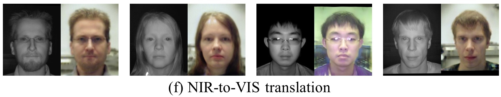

# MvKE-FC
This repository contains more results for the paper:

>**Multi-view Knowledge Ensemble with Frequency Consistency for Face Cross-Domain Translation**
>
>Bing Cao, Qinghe Wang, Pengfei Zhu, Dongwei Ren, Wangmeng Zuo, Qinghua Hu
>
This paper is the first to address cross-domain face translation problem by ensembling multi-view knowledge from models trained on large-scale database designed for related tasks. And we further design the frequency consistent loss (mPrewitt loss and Gaussian fuzzy loss) to better fuse multi-view knowledge.

## FC loss optimization.

## Results

We provide more experimental results in the folders:
>Each image has two faces:

> - Input face
> - Translated face

- [`Photo-to-Sketch Translation on CUFS and CUFSF:`](Results/Photo-to-Sketch-CUFS/)

- [`Sketch-to-Photo Translation on CUFS and CUFSF:`](Results/Sketch-to-Photo-CUFS/)

- [`Photo-to-Drawing Translation on APDrawing:`](Results/Photo-to-Drawing-APDrawing/)

- [`Drawing-to-Photo Translation on APDrawing:`](Results/Drawing-to-Photo-APDrawing/)

- [`NIR-to-VIS Translation on Oulu-CASIA-NIR-VIS:`](Results/NIR-to-VIS-Oulu/)

**The results can also be downloaded from [Google Drive](https://drive.google.com/file/d/1GSKpp9TgfCGtlbbAZGFnce9Kub7-ei6D/view?usp=sharing), or from [Baidu Drive](https://pan.baidu.com/s/1E1RSqDQtuqY5Kb3NCyjl7Q)** with password `1895` (Results on CUFSF are here).

## Databases

- [CUFS Database](http://mmlab.ie.cuhk.edu.hk/archive/facesketch.html)
- [CUFSF Database](http://mmlab.ie.cuhk.edu.hk/archive/cufsf/)
- [APDrawing Database](https://github.com/yiranran/APDrawingGAN)
- [Oulu-CASIA-NIR-VIS Database](https://www.oulu.fi/cmvs/node/41316/)

## Contact

If you have any questions or suggestions about the paper, feel free to reach me (caobing@tju.​edu.cn / aitwqh@163.com).

<!-- &emsp;&emsp;&emsp;&emsp;&emsp;&emsp;&emsp;&emsp;&emsp;&emsp;&emsp;&emsp;&emsp;&emsp;  -->

<!-- - [`Photo-to-Sketch Translation on Universal Styles:`](Results/Photo-to-Sketch-Universal/)

&emsp;&emsp;&emsp;&emsp;&emsp;&emsp;&emsp;&emsp;&emsp;&emsp;&emsp;&emsp;  -->

<!-- &emsp;&emsp;&emsp;&emsp;&emsp;&emsp;&emsp;&emsp;&emsp;&emsp;&emsp;&emsp;&emsp;&emsp; 

- [`Sketch-to-Photo Translation on Universal Styles:`](Results/Sketch-to-Photo-Universal/)

&emsp;&emsp;&emsp;&emsp;&emsp;  -->

